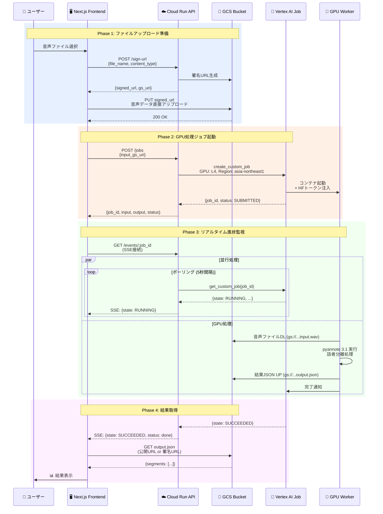
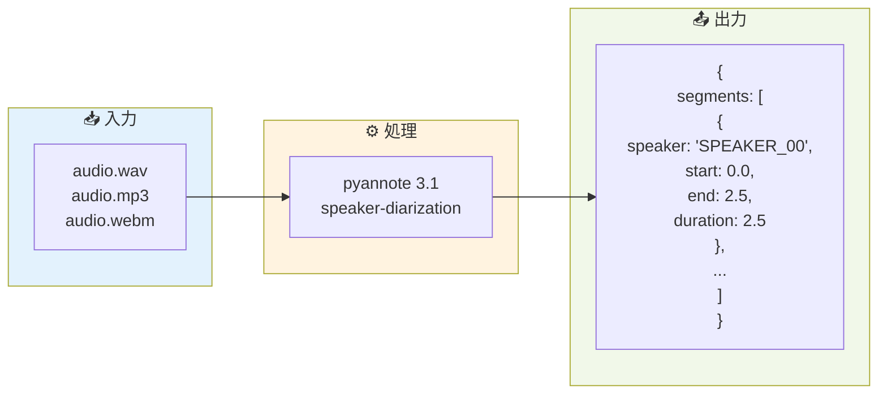
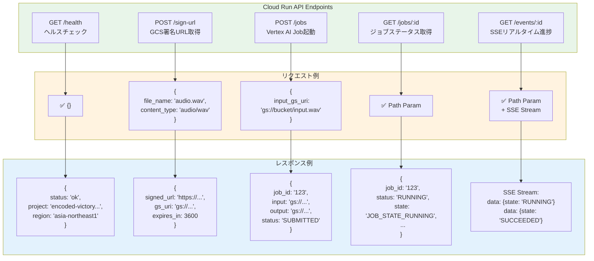
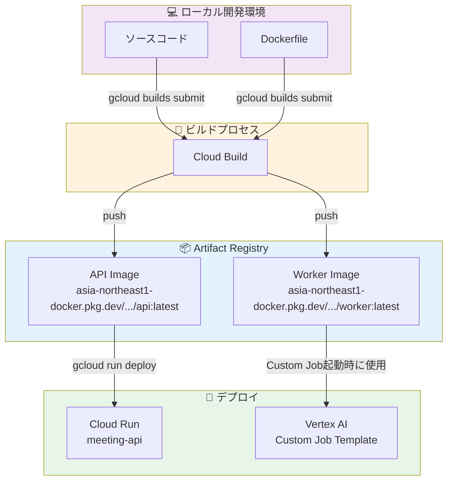
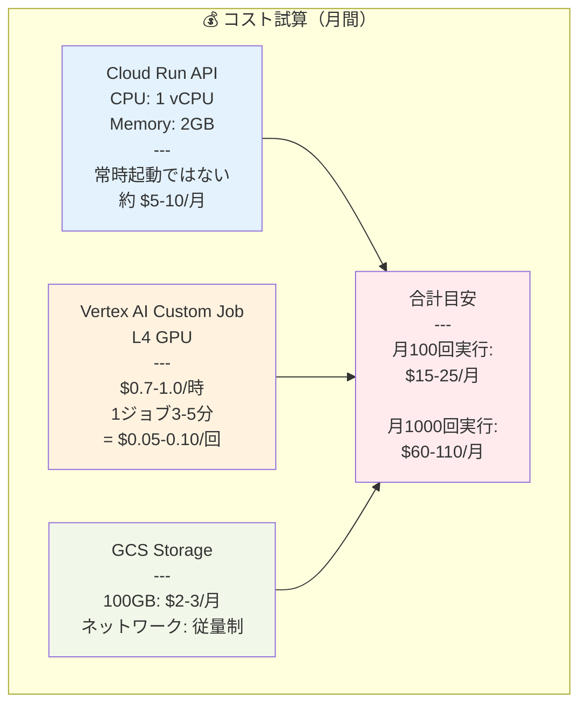
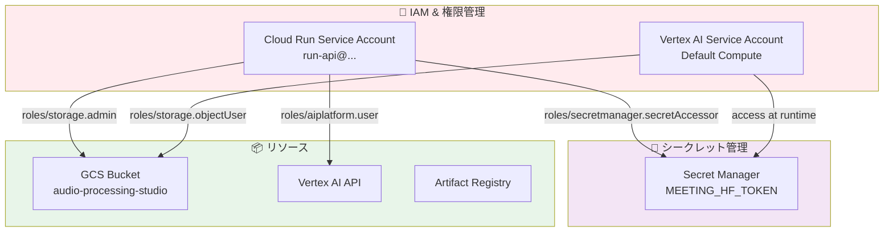
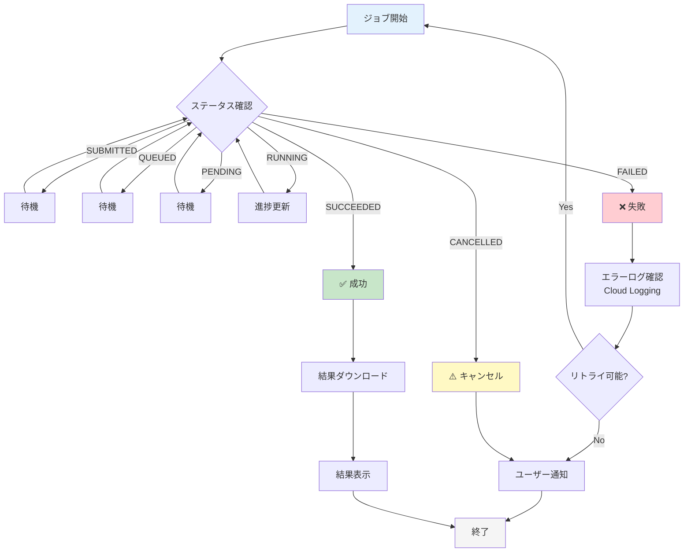
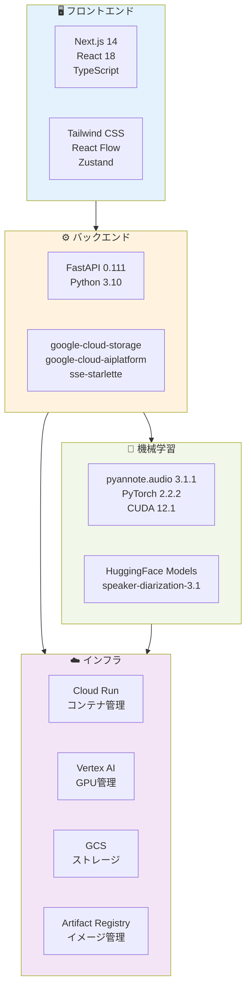

# Cloud Run + Vertex AI アーキテクチャ全体図

## システム全体フロー

```mermaid
graph TB
    subgraph Browser["🌐 ブラウザ (localhost:3000)"]
        UI[Next.js Frontend<br/>Audio Processing Studio]
    end

    subgraph CloudRun["☁️ Cloud Run (CPU)<br/>meeting-api-576239773901.asia-northeast1.run.app"]
        API[FastAPI API Server<br/>Port 8080]
        Health[/health]
        SignURL[POST /sign-url]
        CreateJob[POST /jobs]
        GetJob[GET /jobs/:id]
        SSE[GET /events/:id]
    end

    subgraph GCS["💾 GCS Bucket<br/>audio-processing-studio"]
        Uploads[uploads/<br/>input.wav]
        Results[results/<br/>output.json]
    end

    subgraph VertexAI["🚀 Vertex AI Custom Job"]
        Worker[GPU Worker Container<br/>L4 GPU<br/>pyannote 3.1]
    end

    subgraph ArtifactRegistry["📦 Artifact Registry"]
        APIImage[asia-northeast1-docker.pkg.dev/.../api:latest]
        WorkerImage[asia-northeast1-docker.pkg.dev/.../worker:latest]
    end

    subgraph SecretManager["🔐 Secret Manager"]
        HFToken[MEETING_HF_TOKEN]
    end

    %% フロー
    UI -->|1. 署名URL要求| SignURL
    SignURL -->|2. 署名URL返却| UI
    UI -->|3. 音声ファイルPUT| Uploads
    UI -->|4. ジョブ起動要求| CreateJob
    CreateJob -->|5. Custom Job起動| Worker
    Worker -->|6. 音声DL| Uploads
    Worker -->|7. pyannote 3.1実行| Worker
    Worker -->|8. 結果JSON UP| Results
    Worker -->|9. HFトークン取得| HFToken
    UI -->|10. SSE接続| SSE
    SSE -->|11. リアルタイム進捗| UI
    UI -->|12. ステータス確認| GetJob
    GetJob -->|13. ジョブ詳細| UI
    UI -->|14. 結果DL| Results

    %% デプロイフロー
    APIImage -.->|deploy| API
    WorkerImage -.->|submit| Worker

    style Browser fill:#e1f5ff
    style CloudRun fill:#fff4e6
    style GCS fill:#f0f4c3
    style VertexAI fill:#ffe0b2
    style ArtifactRegistry fill:#f3e5f5
    style SecretManager fill:#ffebee
```

## 詳細フロー（ステップバイステップ）



## データフォーマット



## API エンドポイント詳細



## デプロイメントフロー



## コスト構造



## セキュリティフロー



## エラーハンドリングフロー



## 技術スタック全体像


